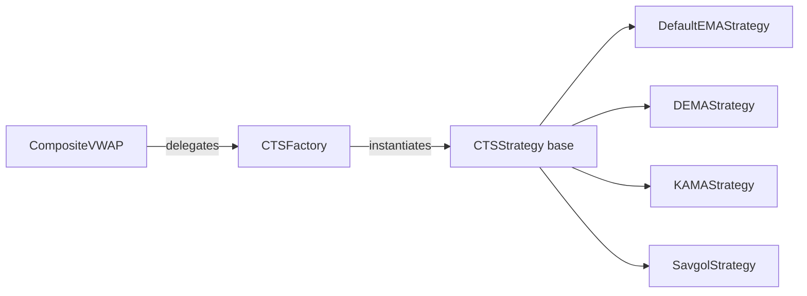
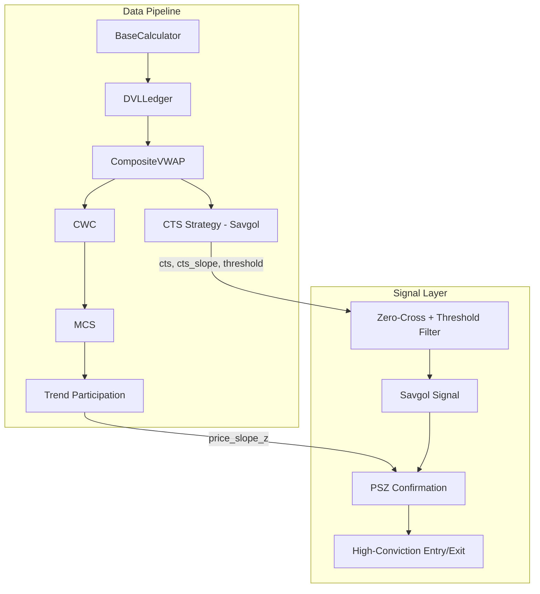

# CTS Code & Methodology Review

> Expert review of the Continuous Trend Score (CTS) system: architecture, mathematics, and walk-forward validation.

---

## 1. Verdict: Reference Document Findings — Confirmed ✅

The claims in [CTS_ANALYSIS_REFERENCE.md](file:///home/vn/python-projects/liquidity-flow-monitor/CTS_ANALYSIS_REFERENCE.md) are **accurate and well-supported** by the code. Specifically:

| Claim | Status | Evidence |
|-------|--------|----------|
| Savgol window=11, polyorder=2 | ✅ Confirmed | [savgol.py:14](file:///home/vn/python-projects/liquidity-flow-monitor/src/divergence_engine/cts/savgol.py#L14) defaults |
| Computed on CWVAP series | ✅ Confirmed | [savgol.py:31](file:///home/vn/python-projects/liquidity-flow-monitor/src/divergence_engine/cts/savgol.py#L31) reads `df["cwvap"]` |
| Normalized by ATR_20 × scale 5.0 | ✅ Confirmed | [savgol.py:57-60](file:///home/vn/python-projects/liquidity-flow-monitor/src/divergence_engine/cts/savgol.py#L57-L60) |
| 35th percentile threshold on \|cts_slope\| | ✅ Confirmed | [savgol.py:71-73](file:///home/vn/python-projects/liquidity-flow-monitor/src/divergence_engine/cts/savgol.py#L71-L73) |
| Non-causal (centered) Savgol filter | ✅ Confirmed | `scipy.signal.savgol_filter` defaults to centered mode |
| Walk-forward simulates EOD execution | ✅ Confirmed | [test_savgol_walkforward.py:55-79](file:///home/vn/python-projects/liquidity-flow-monitor/scripts/test_savgol_walkforward.py#L55-L79) |
| PSZ buy: -0.3 ≤ PSZ ≤ 0 | ✅ Confirmed | [test_savgol_walkforward.py:102](file:///home/vn/python-projects/liquidity-flow-monitor/scripts/test_savgol_walkforward.py#L102) |
| PSZ sell: PSZ ≥ 0.2 | ✅ Confirmed | [test_savgol_walkforward.py:103](file:///home/vn/python-projects/liquidity-flow-monitor/scripts/test_savgol_walkforward.py#L103) |

---

## 2. Architecture Review — Clean Strategy Pattern

The CTS module uses a textbook **Strategy + Factory** pattern. This is well-executed.



**Strengths:**
- Clean separation of concerns — swapping strategies requires only changing a string argument (`cts_strategy='savgol'`)
- The base class provides a shared [_compute_derivatives()](file:///home/vn/python-projects/liquidity-flow-monitor/src/divergence_engine/cts/base.py#24-79) convolution utility for EMA/DEMA/KAMA
- The Savgol strategy correctly bypasses this shared utility since it computes derivatives analytically via `savgol_filter(deriv=N)`

---

## 3. Mathematical Observations

### 3.1 Savgol Derivative Chain — Correct and Elegant

The [SavgolStrategy](file:///home/vn/python-projects/liquidity-flow-monitor/src/divergence_engine/cts/savgol.py#L24-L81) correctly leverages `scipy.signal.savgol_filter`'s built-in derivative computation:

| Output Column | Mathematical Meaning | Savgol Call |
|---------------|---------------------|-------------|
| `cts` | Velocity (1st deriv of CWVAP), ATR-normalized, clipped [-1,1] | `deriv=1` |
| `cts_slope` | Acceleration (2nd deriv), ATR-normalized | `deriv=2` |
| `cts_accel` | Jerk (3rd deriv), via `np.gradient` fallback | `deriv=3` or `np.gradient` |

> [!NOTE]
> The 3rd derivative fallback (`np.gradient` when polyorder < 3) is a **sound engineering choice**. With polyorder=2, a true 3rd-order Savgol derivative would be zero everywhere. `np.gradient` on the 2nd derivative gives a finite-difference approximation that is pragmatically useful, though noisier.

### 3.2 Normalization — Sound

```python
cts = clip((velocity × 5.0) / ATR_20, -1, 1)
```

- **ATR normalization** makes CTS dimensionless and cross-stock comparable — a strong design decision.
- The **scale factor of 5.0** is an empirical amplifier to spread the velocity distribution within the [-1, 1] clip range. This is reasonable; without it, raw velocity/ATR would cluster near zero for most bars.
- **Clipping to [-1, 1]** is appropriate for a "score" that feeds downstream signal logic.

### 3.3 Threshold Mechanism — Effective but Contextual

The 35th percentile threshold ([savgol.py:71-73](file:///home/vn/python-projects/liquidity-flow-monitor/src/divergence_engine/cts/savgol.py#L71-L73)) is computed over **the entire available history** at compute time:

```python
valid_slopes = np.abs(df["cts_slope"].dropna().values)
df["cts_slope_threshold"] = np.percentile(valid_slopes, 35)
```

> [!IMPORTANT]
> **Observation**: This threshold is a **single scalar** for the whole DataFrame. It adapts to the stock's overall volatility profile, but does NOT adapt to regime changes within the history. In a stock that transitions from low-vol to high-vol, the threshold will be a blended value that may be too loose for the quiet period and too tight for the volatile period.
>
> This is flagged for awareness — it works well for typical EOD use (the reference doc's ~150-day windows), but a **rolling percentile** would be more robust for multi-year backtests.

### 3.4 PSZ (Price Slope Z-score) — Solid Foundation

The [trend_participation.py](file:///home/vn/python-projects/liquidity-flow-monitor/src/divergence_engine/analysis/trend_participation.py#L29-L45) PSZ computation is mathematically correct:

```python
slope = np.polyfit(x, arr, 1)[0]   # linear regression slope
z = slope / (std + 1e-10)           # z-normalize by window's own std
```

This is a proper **dimensionless momentum score** — the z-normalization makes the slope comparable across different price levels and volatility regimes.

---

## 4. Code Quality Observations

### 4.1 Minor Issues

| Issue | File | Severity | Detail |
|-------|------|----------|--------|
| Dead code in [base.py](file:///home/vn/python-projects/liquidity-flow-monitor/src/divergence_engine/cts/base.py) | [base.py:70](file:///home/vn/python-projects/liquidity-flow-monitor/src/divergence_engine/cts/base.py#L70) | Low | `conv_accel` from `mode='same'` is computed but never used — the `mode='valid'` result on L75 is what's actually assigned. |
| Copy-paste artifact in [kama.py](file:///home/vn/python-projects/liquidity-flow-monitor/src/divergence_engine/cts/kama.py) | [kama.py:73-76](file:///home/vn/python-projects/liquidity-flow-monitor/src/divergence_engine/cts/kama.py#L73-L76) | Low | A stale `dema_21` reference is caught by a `locals()` guard and then immediately overwritten by the corrected `pairs` list. Should be cleaned up. |
| Duplicate imports in test script | [test_savgol_walkforward.py:15-17 vs 19-21](file:///home/vn/python-projects/liquidity-flow-monitor/scripts/test_savgol_walkforward.py#L15-L21) | Low | `DivergenceEngine`, [CompositeVWAP](file:///home/vn/python-projects/liquidity-flow-monitor/src/divergence_engine/cwvap.py#23-259), `load_symbol_data` imported twice. |
| Typo in comment | [test_savgol_walkforward.py:125](file:///home/vn/python-projects/liquidity-flow-monitor/scripts/test_savgol_walkforward.py#L125) | Trivial | Comment says "PSX" instead of "PSZ". |
| `DivergenceEngine` imported but unused | [test_savgol_walkforward.py:15,19](file:///home/vn/python-projects/liquidity-flow-monitor/scripts/test_savgol_walkforward.py#L15) | Low | Imported twice, used zero times. |

### 4.2 Walk-Forward Simulation — Correctly Structured

The [walk-forward loop](file:///home/vn/python-projects/liquidity-flow-monitor/scripts/test_savgol_walkforward.py#L55-L79) is **properly causal**:
1. It slices `df_full.iloc[:i]` — only data available up to day `i`
2. Runs the **full pipeline** (Base → DVL → CWVAP/CTS → CWC → MCS → Trend Participation)
3. Records only `iloc[-1]` — the last bar's state

This is the correct way to simulate EOD execution without lookahead bias. The omniscient vs. realized comparison is a strong validation technique.

### 4.3 Performance Note

The walk-forward loop recomputes the **entire pipeline** for each day's slice. For a 150-day window over a ~500-bar history, this means ~150 full pipeline runs. This is $O(N \times W)$ where $W$ is the cost of one pipeline pass. Functionally correct, but potentially slow for large windows or batch testing across many tickers.

---

## 5. Structural Summary



---

## 6. Assessment for Next Steps (Backlog Items A & B)

The reference document's backlog items are well-scoped:

### A. Adaptive PSZ Thresholds
- **Feasibility**: High. The [_rolling_slope_z](file:///home/vn/python-projects/liquidity-flow-monitor/src/divergence_engine/analysis/trend_participation.py#39-46) function already produces a clean PSZ series. Computing rolling percentiles is straightforward.
- **Risk**: Low. This is a parameter optimization — no architectural changes needed.

### B. Savgol-Filtered PSZ
- **Feasibility**: High. Simply pipe PSZ through `savgol_filter` with the same window/polyorder.
- **Value**: Potentially very high — a "velocity of momentum" derivative could provide earlier regime-change detection than raw PSZ zero-crosses.
- **Risk**: Medium. Applying Savgol to an already-z-normalized series means the output units are "z-score change per bar" — needs careful interpretation and possibly its own normalization.

---

**Overall Assessment**: The CTS system is architecturally clean, mathematically sound, and the reference document accurately captures its design. The walk-forward methodology is correctly implemented without lookahead bias. The codebase is ready for the next-phase enhancements described in the backlog.
